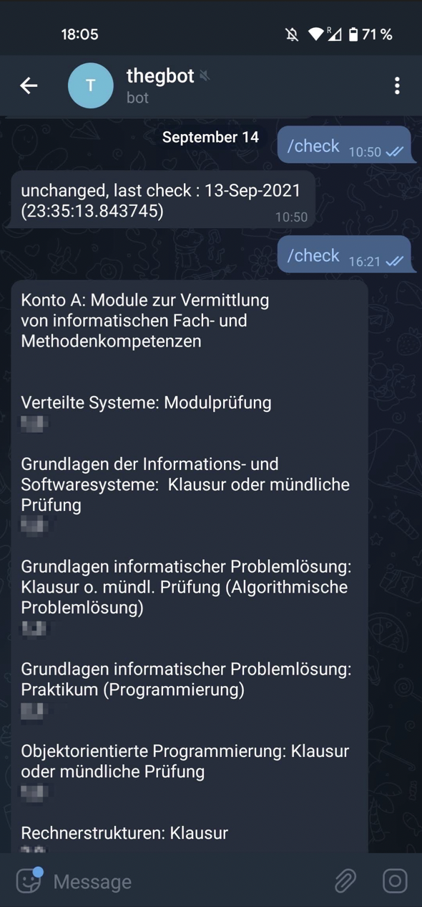

# gbot

This is a telegram bot that regulary checks the student portal of "FSU Jena" for new grades regarding the exams you took.

It can be configured to notify you if there were any changes to your grades (or, more importantly new grades added). 

You can also trigger a manual check by sending the command "/check" to the bot.




## Installation and Usage

requires 
- python3
- pip
- chromedriver

It is very important that the version of chrome and chromedriver match and that the path to chromedriver is correct.

Chat-Id and the bot-token must be obtained from Telegram.

- The bot-token is part of the bot-creation-process.
- The Chat-Id identifies which chat/user the bot will post his messages. 
- There are various guides in the internet explaining how to get the chatId.


chromedriver: 
- https://chromedriver.chromium.org

alternatively, with included chromedriver:
  - google-chrome 
  - chromium-browser

When using a browser that includes chromedriver, the Selenium default path usually works.

```bash
wget https://chromedriver.storage.googleapis.com/VERSION/chromedriver_linux64.zip
unzip chromedriver_linux64.zip
chmod +x chromedriver
sudo mv -f chromedriver /usr/local/share/chromedriver
sudo ln -s /usr/local/share/chromedriver /usr/local/bin/chromedriver
sudo ln -s /usr/local/share/chromedriver /usr/bin/chromedriver

#--> later use chromedriver = '/usr/bin/chromedriver'

pip3 install selenium
pip3 install python-telegram-bot
pip3 install bs4
pip3 install schedule
pip3 install html5lib

git clone https://github.com/r-erd/gbot.git
cd gbot

#add your chat_id, telegram-bot token and friedolin credentials to the code
#maybe adjust the chromedriver path

#start the script

sudo nohup python3 gbot.py &

```

## License
[MIT](https://choosealicense.com/licenses/mit/)

